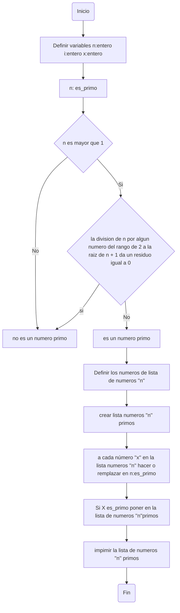
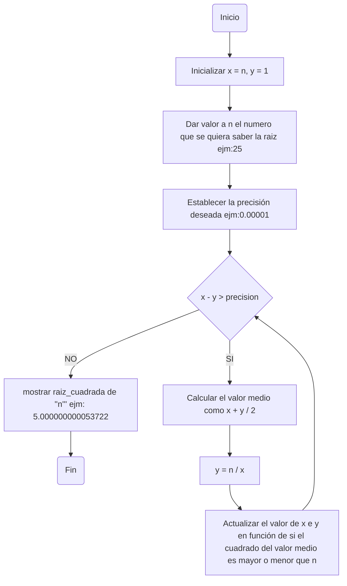

# DIAGRAMAS DE FLUJO Y PSEUDOCODE 🚀
## RETO 4
 - Plantear el algoritmo para obtener los números primos hasta n, usando pseudocódigo y diagramas de flujo
 - Revise el procedimiento matemático para hallar raices cuadradas (son divisiones y restas), plantee el algoritmo en pseudocódigo y en diagrama de flujo.

### NUMEROS PRIMOS EN UN LISTA DE NUMEROS HASTA N
Este codigoo funciona pondiendo condiciones las cuales iterara en cada numero de la lista para seleccionarlos o imprimir como numeros primos, las condiciones son que no sea igual o menor que 1 y que el residuo de su dividon con algun numero en el rango de 2 a la √n+1, este rango se hace para que pueda tomar todos los valores incuyendo el de su raiz propia, en el codigoo se utilizaria una libreria para usar math.sqrt para sacar las raices.

#### PSEUDOCODE
```pseudocode
[variables]
  n: entero
  i: entero
  x: entero
  
Inicio
  n: es_primo
   Si n <= 1: no es primo 
   Para cada numero i tomar un valor del rango del 2 a la raiz de n + 1 
   Si n % 1 == 0 : no es primos
   
 Hacer la lista de numeros n
 Hacer la lista de numeros n primos
 
 Para cada número "x" en la lista "numeros n" se debe 
    Si "x" es_primo entonces agregarlo a la lista "numeros n primos"

Imprimir la lista "numeros n primos"

Fin
  
```
#### DIAGRAMAS DE FLUJO


### RAICES CUARADAS 
El método de la bisección es un algoritmo de búsqueda que se utiliza para encontrar el cero (o raíz) de una función. El algoritmo comienza con un intervalo que contiene la raíz y lo divide sucesivamente a la mitad hasta que se alcanza la precisión deseada.

#### PSEUDOCODE
```pseudocode
[variables]
n: real positivo
y: entero
precision:
Incio
Algoritmo raiz_cuadrada (n)
Se inicializan las variables
    x = n
    y = 1
    precisión = 0.000001

    mientras (x - y > precisión) hacer:
        x = (x + y) / 2
        y = n / x

    devolver x
n= numero que da el usuario que quiera sacar su raiz
print(raiz_cuadrada(n))
Fin

```
#### DIAGRAMAS DE FLUJO

