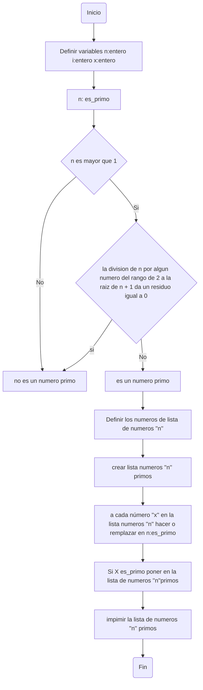

# DIAGRAMAS-DE-FLUJO-Y-PSEUDOCODE
## RETO 4
 - Plantear el algoritmo para obtener los números primos hasta n, usando pseudocódigo y diagramas de flujo
 - Revise el procedimiento matemático para hallar raices cuadradas (son divisiones y restas), plantee el algoritmo en pseudocódigo y en diagrama de flujo.

### NUMEROS PRIMOS EN UN LISTA DE NUMEROS HASTA N
#### PSEUDOCODE
```pseudocode
[variables]
  n: entero
  i: entero
  x: entero
  
Inicio
  n: es_primo
   Si n <= 1: no es primo 
   Para cada numero i tomar un valor del rango del 2 a la raiz de n + 1 
   Si n % 1 == 0 : no es primos
   
 Hacer la lista de numeros n
 Hacer la lista de numeros n primos
 
 Para cada número "x" en la lista "numeros n" se debe 
    Si "x" es_primo entonces agregarlo a la lista "numeros n primos"

Imprimir la lista "numeros n primos"

Fin
  
```
#### DIAGRAMAS DE FLUJO


### RAICES CUARADAS 
#### PSEUDOCODE
```pseudocode
[variables]

  
Inicio
 

Fin
  
```
#### DIAGRAMAS DE FLUJO
```mermaid
graph TD;
   

```
